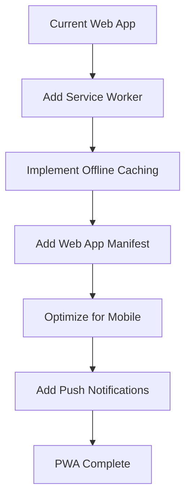
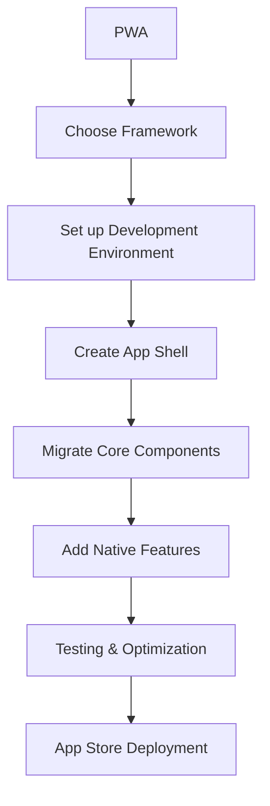

# Scalability & Future Roadmap

## Phase 1: Current Web Application (MVP)
**Timeline: 2-4 weeks**
**Status: Planning Complete**

### Core Features
- ✅ Ingredient input with smart suggestions
- ✅ Basic filtering (time, servings, diet)
- ✅ Recipe search and display
- ✅ Recipe detail modal
- ✅ Responsive design
- ✅ Error handling and loading states

### Technical Foundation
- Static hosting (Netlify/Vercel)
- Frontend-only architecture
- Spoonacular API integration
- Local storage for caching
- Vanilla JavaScript implementation

## Phase 2: Enhanced Web Features (3-6 months)
**Focus: User Engagement & Retention**

### New Features
```javascript
// Enhanced features roadmap
const phase2Features = {
  userPreferences: {
    description: "Save user preferences and search history",
    implementation: "localStorage + optional user accounts",
    priority: "High"
  },
  
  favoriteRecipes: {
    description: "Save and organize favorite recipes",
    implementation: "Local storage + sync to cloud storage",
    priority: "High"
  },
  
  mealPlanning: {
    description: "Weekly meal planning with shopping lists",
    implementation: "Calendar component + list generation",
    priority: "Medium"
  },
  
  nutritionTracking: {
    description: "Track nutritional information",
    implementation: "Enhanced API calls + local calculations",
    priority: "Medium"
  },
  
  socialSharing: {
    description: "Share recipes on social media",
    implementation: "Web Share API + custom sharing",
    priority: "Low"
  }
};
```

### Technical Enhancements
- **Progressive Web App (PWA)**: Service worker, offline functionality
- **Advanced Caching**: IndexedDB for recipe storage
- **Performance**: Code splitting, lazy loading
- **Analytics**: User behavior tracking (privacy-focused)
- **SEO**: Server-side rendering consideration

## Phase 3: Mobile App Development (6-12 months)
**Focus: Native Mobile Experience**

### App Development Strategy

#### Option A: Progressive Web App (PWA) Enhancement
**Pros:**
- Leverage existing codebase
- Single codebase for all platforms
- Faster development time
- Lower maintenance overhead

**Implementation:**
```javascript
// PWA Manifest
{
  "name": "Recipe Finder",
  "short_name": "RecipeFinder",
  "description": "Find recipes with ingredients you have",
  "start_url": "/",
  "display": "standalone",
  "background_color": "#FAFAFA",
  "theme_color": "#2E7D32",
  "icons": [
    {
      "src": "/icons/icon-192.png",
      "sizes": "192x192",
      "type": "image/png"
    },
    {
      "src": "/icons/icon-512.png",
      "sizes": "512x512",
      "type": "image/png"
    }
  ]
}
```

**PWA Features:**
- Offline recipe browsing
- Push notifications for meal reminders
- Camera integration for ingredient recognition
- Device storage for large recipe database

#### Option B: React Native Development
**Pros:**
- True native performance
- Access to device features
- App store distribution
- Better user experience

**Architecture Migration:**
```javascript
// Component structure for React Native
const AppStructure = {
  screens: {
    HomeScreen: "Main ingredient input and search",
    ResultsScreen: "Recipe results grid",
    RecipeDetailScreen: "Full recipe view",
    FavoritesScreen: "Saved recipes",
    SettingsScreen: "User preferences"
  },
  
  navigation: {
    type: "Stack + Tab Navigation",
    library: "@react-navigation/native"
  },
  
  stateManagement: {
    library: "Redux Toolkit",
    persistence: "@reduxjs/toolkit-query"
  }
};
```

#### Option C: Flutter Development
**Pros:**
- Single codebase for iOS and Android
- Excellent performance
- Rich UI components
- Growing ecosystem

### Mobile-Specific Features

#### Camera Integration
```javascript
// Ingredient recognition via camera
const cameraFeatures = {
  ingredientRecognition: {
    description: "Scan ingredients with camera",
    implementation: "ML Kit / TensorFlow Lite",
    accuracy: "70-80% for common ingredients"
  },
  
  barcodeScanning: {
    description: "Scan product barcodes",
    implementation: "Native barcode scanner",
    integration: "Product database lookup"
  },
  
  receiptScanning: {
    description: "Extract ingredients from receipts",
    implementation: "OCR + text processing",
    accuracy: "60-70% depending on receipt quality"
  }
};
```

#### Device Integration
```javascript
// Native device features
const deviceFeatures = {
  notifications: {
    mealReminders: "Scheduled local notifications",
    newRecipes: "Push notifications for trending recipes",
    shoppingReminders: "Grocery shopping alerts"
  },
  
  storage: {
    offlineRecipes: "SQLite database for offline access",
    imageCache: "Cached recipe images",
    userPreferences: "Encrypted local storage"
  },
  
  sharing: {
    nativeSharing: "iOS/Android native share sheets",
    socialMedia: "Direct integration with social apps",
    messaging: "Share recipes via SMS/WhatsApp"
  }
};
```

## Phase 4: Advanced Features (12-18 months)
**Focus: AI & Personalization**

### AI-Powered Features

#### Smart Recipe Recommendations
```javascript
const aiFeatures = {
  personalizedRecommendations: {
    description: "ML-based recipe suggestions",
    dataPoints: [
      "Previous searches",
      "Saved recipes",
      "Cooking frequency",
      "Dietary preferences",
      "Seasonal ingredients"
    ],
    implementation: "TensorFlow.js or cloud ML service"
  },
  
  ingredientSubstitution: {
    description: "Suggest ingredient alternatives",
    useCase: "Missing ingredients or dietary restrictions",
    implementation: "Rule-based system + ML enhancement"
  },
  
  cookingAssistant: {
    description: "Step-by-step cooking guidance",
    features: [
      "Voice commands",
      "Timer integration",
      "Progress tracking",
      "Difficulty adjustment"
    ]
  }
};
```

#### Computer Vision Integration
```javascript
const visionFeatures = {
  fridgeScanning: {
    description: "Scan entire fridge/pantry",
    implementation: "Custom ML model + ingredient detection",
    accuracy: "85%+ for common ingredients"
  },
  
  dishRecognition: {
    description: "Identify dishes from photos",
    useCase: "Reverse recipe lookup",
    implementation: "Pre-trained food classification model"
  },
  
  portionEstimation: {
    description: "Estimate serving sizes from images",
    implementation: "Object detection + size estimation",
    accuracy: "±20% for most dishes"
  }
};
```

### Backend Infrastructure (Optional)

#### Microservices Architecture
```javascript
const backendServices = {
  userService: {
    responsibilities: ["Authentication", "User profiles", "Preferences"],
    technology: "Node.js + Express",
    database: "PostgreSQL"
  },
  
  recipeService: {
    responsibilities: ["Recipe CRUD", "Search optimization", "Caching"],
    technology: "Node.js + Fastify",
    database: "MongoDB + Redis"
  },
  
  recommendationService: {
    responsibilities: ["ML recommendations", "Personalization"],
    technology: "Python + FastAPI",
    database: "Vector database (Pinecone/Weaviate)"
  },
  
  notificationService: {
    responsibilities: ["Push notifications", "Email campaigns"],
    technology: "Node.js + Bull Queue",
    infrastructure: "Firebase Cloud Messaging"
  }
};
```

## Migration Strategy

### From Web to PWA


### From PWA to Native App


## Technical Debt Management

### Code Quality Maintenance
```javascript
const qualityMeasures = {
  testing: {
    unit: "Jest + Testing Library (80%+ coverage)",
    integration: "Cypress for E2E testing",
    performance: "Lighthouse CI for performance monitoring"
  },
  
  codeStandards: {
    linting: "ESLint + Prettier",
    typeChecking: "TypeScript migration (gradual)",
    documentation: "JSDoc + Storybook for components"
  },
  
  monitoring: {
    errors: "Sentry for error tracking",
    performance: "Web Vitals monitoring",
    analytics: "Privacy-focused analytics (Plausible)"
  }
};
```

### Performance Optimization Roadmap
```javascript
const performanceOptimizations = {
  phase1: {
    imageOptimization: "WebP format + lazy loading",
    codeMinification: "Terser + CSS minification",
    caching: "Aggressive browser caching"
  },
  
  phase2: {
    bundleOptimization: "Code splitting + tree shaking",
    preloading: "Critical resource preloading",
    cdn: "CDN for static assets"
  },
  
  phase3: {
    serverSideRendering: "Next.js or similar framework",
    edgeComputing: "Cloudflare Workers for API caching",
    databaseOptimization: "Query optimization + indexing"
  }
};
```

## Monetization Strategy (Future Consideration)

### Revenue Models
```javascript
const monetizationOptions = {
  freemium: {
    free: [
      "Basic recipe search",
      "Limited daily searches",
      "Standard recipes"
    ],
    premium: [
      "Unlimited searches",
      "Advanced filters",
      "Meal planning",
      "Nutrition tracking",
      "Ad-free experience"
    ],
    pricing: "$4.99/month or $39.99/year"
  },
  
  partnerships: {
    groceryStores: "Affiliate links for ingredients",
    kitchenware: "Equipment recommendations",
    mealKits: "Integration with meal kit services"
  },
  
  dataInsights: {
    description: "Anonymized cooking trends (B2B)",
    compliance: "GDPR/CCPA compliant",
    target: "Food industry research"
  }
};
```

## Risk Mitigation

### Technical Risks
```javascript
const riskMitigation = {
  apiDependency: {
    risk: "Spoonacular API changes or pricing",
    mitigation: [
      "Multiple API providers",
      "Local recipe database backup",
      "Gradual migration strategy"
    ]
  },
  
  scalability: {
    risk: "High user growth overwhelming infrastructure",
    mitigation: [
      "Horizontal scaling architecture",
      "CDN implementation",
      "Database sharding strategy"
    ]
  },
  
  competition: {
    risk: "Large players entering market",
    mitigation: [
      "Focus on unique features",
      "Strong user experience",
      "Community building"
    ]
  }
};
```

## Success Metrics & KPIs

### Phase 1 (Web App)
- **User Engagement**: 70%+ search completion rate
- **Performance**: <3s initial load time
- **Usability**: <5% error rate in user flows

### Phase 2 (Enhanced Web)
- **Retention**: 40%+ weekly active users
- **Feature Adoption**: 60%+ users save recipes
- **Performance**: 90+ Lighthouse score

### Phase 3 (Mobile App)
- **Downloads**: 10K+ in first 3 months
- **Rating**: 4.5+ stars in app stores
- **Engagement**: 3+ sessions per week per user

### Phase 4 (AI Features)
- **Recommendation Accuracy**: 80%+ user satisfaction
- **AI Feature Usage**: 50%+ of active users
- **Retention**: 60%+ monthly active users

This roadmap provides a clear path from the current simple web application to a sophisticated, AI-powered recipe platform while maintaining focus on user value and technical sustainability.