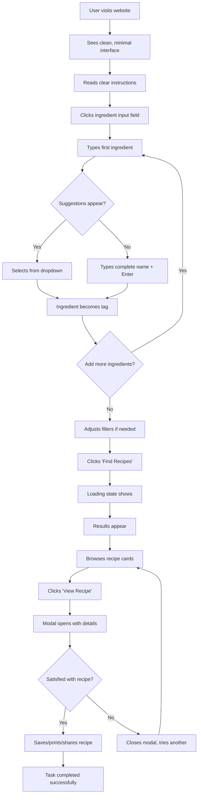
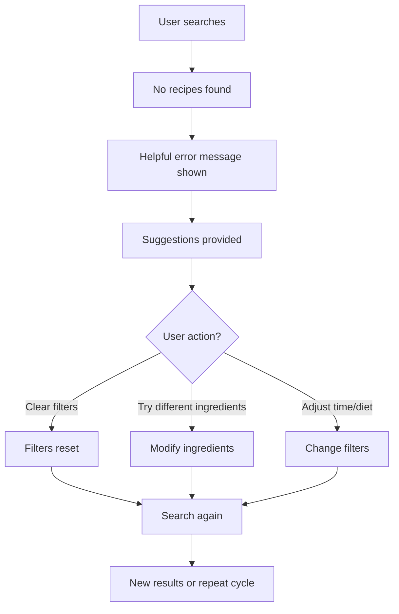
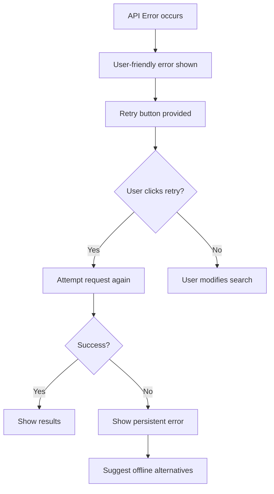

# User Experience Flow & Responsive Design

## User Experience Flow

### Primary User Journey


### Alternative Flows

#### No Results Flow


#### Error Recovery Flow


## Responsive Design Specifications

### Breakpoint Strategy
```css
/* Mobile First Approach */
:root {
  --breakpoint-sm: 480px;   /* Small phones */
  --breakpoint-md: 768px;   /* Tablets */
  --breakpoint-lg: 1024px;  /* Small laptops */
  --breakpoint-xl: 1200px;  /* Desktop */
  --breakpoint-2xl: 1440px; /* Large desktop */
}
```

### Mobile Design (320px - 767px)

#### Layout Adjustments
```css
@media (max-width: 767px) {
  .container {
    padding: 0 16px;
    max-width: 100%;
  }
  
  .app-header {
    padding: 20px 0;
    text-align: center;
  }
  
  .app-title {
    font-size: 1.5rem;
  }
  
  .app-subtitle {
    font-size: 0.875rem;
    margin-top: 4px;
  }
}
```

#### Input & Filter Layout
```css
@media (max-width: 767px) {
  .ingredient-input {
    font-size: 16px; /* Prevent zoom on iOS */
    padding: 12px 16px;
  }
  
  .filters-container {
    display: flex;
    flex-direction: column;
    gap: 12px;
    margin-top: 20px;
  }
  
  .filter-group {
    width: 100%;
  }
  
  .filter-select {
    width: 100%;
    padding: 12px 16px;
    font-size: 16px;
  }
  
  .search-btn {
    width: 100%;
    padding: 16px;
    font-size: 1.1rem;
    margin-top: 24px;
  }
}
```

#### Recipe Cards - Mobile
```css
@media (max-width: 767px) {
  .results-grid {
    display: flex;
    flex-direction: column;
    gap: 16px;
  }
  
  .recipe-card {
    display: flex;
    flex-direction: row;
    height: 120px;
    border-radius: 8px;
    overflow: hidden;
  }
  
  .recipe-image {
    width: 120px;
    height: 120px;
    object-fit: cover;
    flex-shrink: 0;
  }
  
  .recipe-content {
    flex: 1;
    padding: 12px;
    display: flex;
    flex-direction: column;
    justify-content: space-between;
  }
  
  .recipe-title {
    font-size: 1rem;
    line-height: 1.3;
    margin-bottom: 4px;
  }
  
  .recipe-meta {
    font-size: 0.75rem;
    margin-bottom: 8px;
  }
  
  .ingredient-match {
    display: none; /* Hide on mobile to save space */
  }
  
  .recipe-summary {
    font-size: 0.8rem;
    line-height: 1.3;
    display: -webkit-box;
    -webkit-line-clamp: 2;
    -webkit-box-orient: vertical;
    overflow: hidden;
  }
  
  .view-recipe-btn {
    align-self: flex-start;
    padding: 6px 12px;
    font-size: 0.8rem;
  }
}
```

#### Mobile Modal
```css
@media (max-width: 767px) {
  .modal-content {
    width: 100vw;
    height: 100vh;
    max-width: none;
    max-height: none;
    border-radius: 0;
    overflow-y: auto;
  }
  
  .modal-header {
    position: sticky;
    top: 0;
    background: white;
    z-index: 10;
    padding: 16px;
    border-bottom: 1px solid #eee;
  }
  
  .recipe-image-large {
    height: 200px;
  }
  
  .recipe-details {
    padding: 16px;
  }
  
  .ingredients-list {
    font-size: 0.9rem;
  }
  
  .instructions-list {
    font-size: 0.9rem;
  }
  
  .nutrition-grid {
    grid-template-columns: repeat(2, 1fr);
    gap: 12px;
  }
}
```

### Tablet Design (768px - 1023px)

#### Layout Adjustments
```css
@media (min-width: 768px) and (max-width: 1023px) {
  .container {
    padding: 0 32px;
    max-width: 100%;
  }
  
  .filters-container {
    display: grid;
    grid-template-columns: 1fr 1fr;
    gap: 16px;
    margin-top: 24px;
  }
  
  .filter-group:last-child {
    grid-column: 1 / -1;
    max-width: 50%;
  }
  
  .results-grid {
    grid-template-columns: repeat(2, 1fr);
    gap: 20px;
  }
  
  .recipe-card {
    display: flex;
    flex-direction: column;
  }
}
```

### Desktop Design (1024px+)

#### Full Layout
```css
@media (min-width: 1024px) {
  .container {
    max-width: var(--container-max-width);
    margin: 0 auto;
    padding: 0 40px;
  }
  
  .filters-container {
    display: flex;
    gap: 24px;
    margin-top: 32px;
    justify-content: center;
  }
  
  .filter-group {
    min-width: 160px;
  }
  
  .results-grid {
    grid-template-columns: repeat(3, 1fr);
    gap: 24px;
  }
  
  .recipe-card:hover {
    transform: translateY(-4px);
    box-shadow: var(--shadow-lg);
  }
  
  .modal-content {
    max-width: 800px;
    max-height: 90vh;
  }
}
```

## Touch & Interaction Design

### Touch Targets
```css
/* Minimum 44px touch targets for mobile */
@media (max-width: 767px) {
  .ingredient-tag .tag-remove {
    min-width: 44px;
    min-height: 44px;
    display: flex;
    align-items: center;
    justify-content: center;
  }
  
  .filter-select {
    min-height: 44px;
  }
  
  .search-btn {
    min-height: 48px;
  }
  
  .view-recipe-btn {
    min-height: 44px;
    min-width: 120px;
  }
}
```

### Gesture Support
```css
/* Swipe to remove ingredient tags on mobile */
.ingredient-tag {
  position: relative;
  overflow: hidden;
}

.ingredient-tag.swipe-left {
  transform: translateX(-100px);
  opacity: 0;
  transition: all 0.3s ease-out;
}

/* Pull to refresh indicator */
.pull-refresh {
  position: fixed;
  top: -60px;
  left: 50%;
  transform: translateX(-50%);
  background: var(--color-primary);
  color: white;
  padding: 12px 24px;
  border-radius: 0 0 12px 12px;
  transition: top 0.3s ease-out;
}

.pull-refresh.active {
  top: 0;
}
```

## Error Handling & Loading States

### Loading States Design

#### Search Loading
```html
<div class="loading-state">
  <div class="loading-spinner">
    <div class="spinner-ring"></div>
  </div>
  <p class="loading-text">Searching for delicious recipes...</p>
  <div class="loading-progress">
    <div class="progress-bar"></div>
  </div>
</div>
```

```css
.loading-spinner {
  width: 40px;
  height: 40px;
  margin: 0 auto 16px;
}

.spinner-ring {
  width: 100%;
  height: 100%;
  border: 3px solid var(--color-accent);
  border-top: 3px solid var(--color-primary);
  border-radius: 50%;
  animation: spin 1s linear infinite;
}

@keyframes spin {
  0% { transform: rotate(0deg); }
  100% { transform: rotate(360deg); }
}

.loading-progress {
  width: 200px;
  height: 4px;
  background: var(--color-accent);
  border-radius: 2px;
  overflow: hidden;
  margin: 0 auto;
}

.progress-bar {
  height: 100%;
  background: var(--color-primary);
  border-radius: 2px;
  animation: progress 2s ease-in-out infinite;
}

@keyframes progress {
  0% { width: 0%; transform: translateX(-100%); }
  50% { width: 100%; transform: translateX(0%); }
  100% { width: 100%; transform: translateX(100%); }
}
```

#### Skeleton Loading for Recipe Cards
```html
<div class="recipe-skeleton">
  <div class="skeleton-image"></div>
  <div class="skeleton-content">
    <div class="skeleton-title"></div>
    <div class="skeleton-meta"></div>
    <div class="skeleton-text"></div>
    <div class="skeleton-text short"></div>
    <div class="skeleton-button"></div>
  </div>
</div>
```

```css
.skeleton-image,
.skeleton-title,
.skeleton-meta,
.skeleton-text,
.skeleton-button {
  background: linear-gradient(90deg, #f0f0f0 25%, #e0e0e0 50%, #f0f0f0 75%);
  background-size: 200% 100%;
  animation: skeleton-loading 1.5s infinite;
  border-radius: 4px;
}

@keyframes skeleton-loading {
  0% { background-position: 200% 0; }
  100% { background-position: -200% 0; }
}

.skeleton-image {
  width: 100%;
  height: 200px;
  margin-bottom: 16px;
}

.skeleton-title {
  height: 20px;
  width: 80%;
  margin-bottom: 8px;
}

.skeleton-meta {
  height: 16px;
  width: 60%;
  margin-bottom: 12px;
}

.skeleton-text {
  height: 14px;
  width: 100%;
  margin-bottom: 6px;
}

.skeleton-text.short {
  width: 70%;
}

.skeleton-button {
  height: 36px;
  width: 120px;
  margin-top: 12px;
}
```

### Error States Design

#### Network Error
```html
<div class="error-state network-error">
  <div class="error-icon">📡</div>
  <h2 class="error-title">Connection Problem</h2>
  <p class="error-message">
    We couldn't connect to our recipe database. 
    Please check your internet connection and try again.
  </p>
  <div class="error-actions">
    <button class="retry-btn primary">Try Again</button>
    <button class="offline-btn secondary">Browse Offline Recipes</button>
  </div>
</div>
```

#### No Results Error
```html
<div class="error-state no-results">
  <div class="error-icon">🔍</div>
  <h2 class="error-title">No Recipes Found</h2>
  <p class="error-message">
    We couldn't find any recipes with your current ingredients and filters.
  </p>
  <div class="suggestions">
    <h3>Try these suggestions:</h3>
    <ul>
      <li>Remove some dietary restrictions</li>
      <li>Increase the cooking time limit</li>
      <li>Add more common ingredients like onions or garlic</li>
      <li>Try different ingredient combinations</li>
    </ul>
  </div>
  <div class="error-actions">
    <button class="clear-filters-btn primary">Clear All Filters</button>
    <button class="modify-search-btn secondary">Modify Search</button>
  </div>
</div>
```

#### API Rate Limit Error
```html
<div class="error-state rate-limit">
  <div class="error-icon">⏰</div>
  <h2 class="error-title">Too Many Searches</h2>
  <p class="error-message">
    You've reached the search limit for now. Please wait a moment before searching again.
  </p>
  <div class="countdown">
    <span>Try again in: </span>
    <span class="countdown-timer">2:30</span>
  </div>
  <div class="error-actions">
    <button class="browse-cached-btn primary">Browse Recent Recipes</button>
  </div>
</div>
```

### Error State Styling
```css
.error-state {
  text-align: center;
  padding: 48px 24px;
  max-width: 500px;
  margin: 0 auto;
}

.error-icon {
  font-size: 4rem;
  margin-bottom: 24px;
  opacity: 0.8;
}

.error-title {
  font-size: 1.5rem;
  font-weight: 600;
  color: var(--color-text);
  margin-bottom: 16px;
}

.error-message {
  font-size: 1rem;
  color: var(--color-text-secondary);
  line-height: 1.5;
  margin-bottom: 24px;
}

.suggestions {
  text-align: left;
  background: var(--color-accent);
  padding: 20px;
  border-radius: var(--border-radius);
  margin-bottom: 24px;
}

.suggestions h3 {
  font-size: 1rem;
  font-weight: 600;
  margin-bottom: 12px;
  color: var(--color-text);
}

.suggestions ul {
  list-style: none;
  padding: 0;
}

.suggestions li {
  padding: 4px 0;
  color: var(--color-text-secondary);
  position: relative;
  padding-left: 20px;
}

.suggestions li::before {
  content: "•";
  color: var(--color-primary);
  position: absolute;
  left: 0;
}

.error-actions {
  display: flex;
  gap: 12px;
  justify-content: center;
  flex-wrap: wrap;
}

.countdown {
  background: var(--color-accent);
  padding: 12px 20px;
  border-radius: var(--border-radius);
  margin-bottom: 24px;
  font-weight: 500;
}

.countdown-timer {
  color: var(--color-primary);
  font-weight: 600;
}

@media (max-width: 767px) {
  .error-actions {
    flex-direction: column;
  }
  
  .error-actions button {
    width: 100%;
  }
}
```

This comprehensive UX flow and responsive design ensures the recipe generator works seamlessly across all devices while providing clear feedback and error recovery options for users.